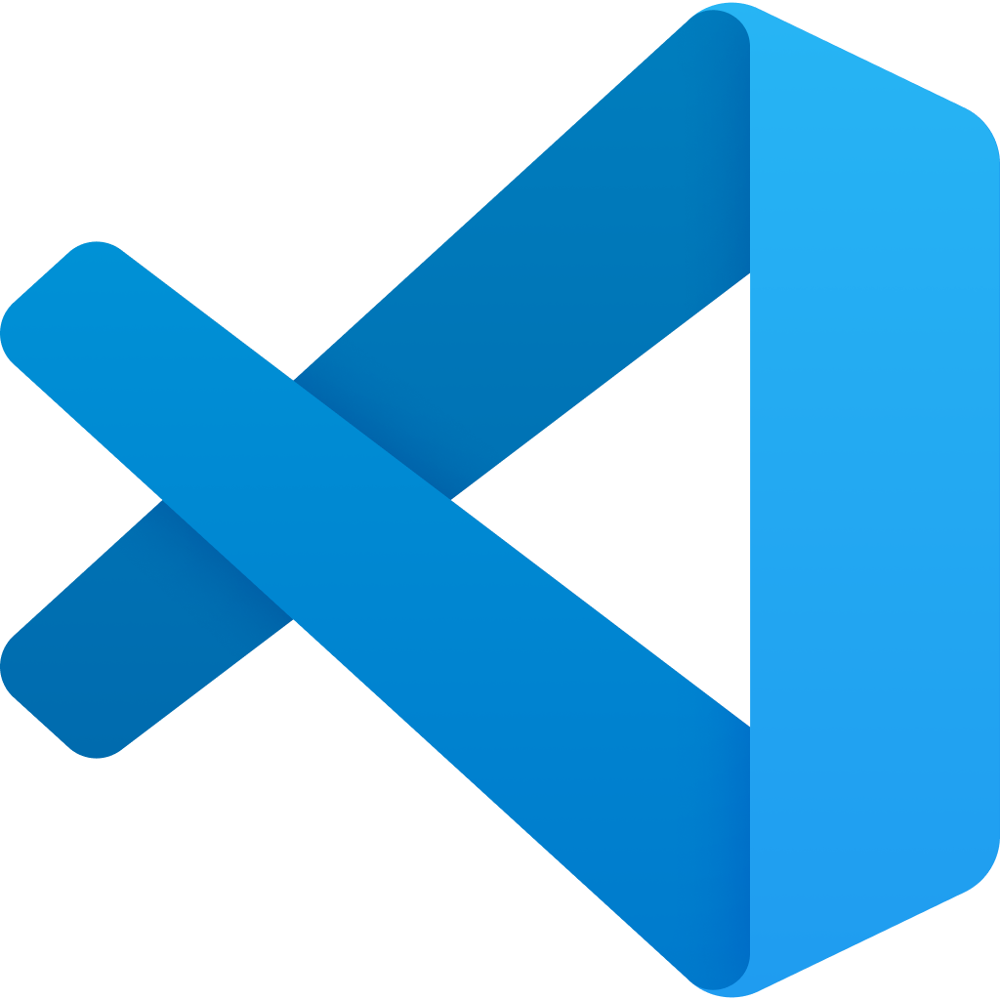
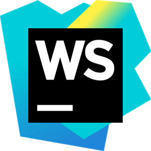

<!-- PROJECT LOGO -->
<br />
<p align="center">
  <a href="https://github.com/akhilben/angular-best-practices">
    
  </a>

  <h3 align="center">Angular Awesome</h3>

  <p align="center">
    A curated list of Angular best practices and tips for building better, scalable and performant enterprise level applications.
    <br />
    <a href="https://github.com/akhilben/angular-best-practices/issues">Report Bug</a>
    ·
    <a href="https://github.com/akhilben/angular-best-practices/issues">Request Feature</a>
  </p>
</p>


<!-- TABLE OF CONTENTS -->
## Table of Contents

* [Purpose](#purpose)
* [Choosing IDE](#choosing-ide)
* [Using Starter Kits](#using-starter-kits)
* [Roadmap](#roadmap)
* [Contributing](#contributing)
* [License](#license)
* [Contact](#contact)
* [Acknowledgements](#acknowledgements)


<!-- ABOUT THE PROJECT -->
## Purpose

Angular is a great and leading framework for developing various web applications. But, for starters, it's really difficult for them to know which way they should do certain things, and whether they are doing it right or not. Even for experienced devolepers, during the development process, they tend to make mistakes by forgetting some rules and recommendations. This is for those folks as a reference to look at from time to time to refresh memory and to develop better. Step in to find some of the recommended good practices and tips for building awesome Angular applications.


<!-- CHOOSING IDE -->
## Choosing IDE
<details>
  <summary>Click to expand</summary>
There are several powerful free and paid IDE's available in the market today. Choosing the right IDE is very important for development since not all IDE's are great for every language/framework/library. Below is a list of recommended IDE's to choose from:

1.  &nbsp; <b>[Visual Studio Code](https://code.visualstudio.com/)</b><br />
   VS Code is a very powerful code editor from Microsoft which is highly recommended for working with Angular. Why? It has a great <b>support for TypeScript</b> out of the box. Moreover, it has <b>syntax highlighting</b> and autocomplete with <b>IntelliSense</b>, which provides smart completions based on variable types, function definitions, and imported modules. Adding up to many other powerfull features, it is <b>highly customizable with tons of extensions</b>, especially for Angular. Below is a list of few vs code extensions that are useful while developing Angular applications. <br />
   * [TS Lint](https://marketplace.visualstudio.com/items?itemName=ms-vscode.vscode-typescript-tslint-plugin):<br />
   A must have extension which marks the code where you have a problem and display a <b>list of warnings & errors</b> on hovering it. It even have an <b>autofix problems</b> functionality. This will help you to adhere to the recommented styleguides and conventions for Angular.<br />
   * [Angular Language Service](https://marketplace.visualstudio.com/items?itemName=Angular.ng-template):<br />
   This extension provides a rich editing experience <b>for Angular templates</b>, both inline and external templates including <b>completions lists, AOT diagnostic messages, quick info and go to definition</b><br />
   * [Angular Snippets](https://marketplace.visualstudio.com/items?itemName=johnpapa.Angular2):<br />
   This extension adds <b>snippets for Angular for TypeScript, HTML and NgRx</b>. This will help you save a lot of time while developing applications. Just type part of a snippet, press enter, and the snippet unfolds! [Angular 8 Snippets](https://marketplace.visualstudio.com/items?itemName=Mikael.Angular-BeastCode) is also another similar, honorable mention.
   * [Angular Schematics](https://marketplace.visualstudio.com/items?itemName=cyrilletuzi.angular-schematics):<br />
   This extension allows you to <b>generate Angular schematics with a Graphical User Interface</b>. This extension promote Angular good practices, by improving component generation with the suggestion of different component types. Use this extension to <b>quickly generate component, module, service</b> etc. [Angular Files](https://marketplace.visualstudio.com/items?itemName=alexiv.vscode-angular2-files) is also another similar, honorable mention.
   * [Prettier - Code formatter](https://marketplace.visualstudio.com/items?itemName=esbenp.prettier-vscode):<br />
   Prettier is an opinionated <b>code formatter</b>. It enforces a consistent style by parsing your code and re-printing it with its own rules that take the maximum line length into account, wrapping code when necessary.<br />
   * [GitLens — Git supercharged](https://marketplace.visualstudio.com/items?itemName=eamodio.gitlens):<br />
   GitLens supercharges the Git capabilities built into Visual Studio Code. It helps you to <b>visualize code authorship</b> at a glance via Git blame annotations and code lens, seamlessly <b>navigate and explore Git repositories</b>, gain valuable <b>insights via powerful comparison commands</b>, and so much more.
   
   
2.  &nbsp; <b>[WebStorm](https://www.jetbrains.com/webstorm/)</b><br />
 One of the smartest and most powerful IDE's for developing Javascript applications available out there. WebStorm by IntelliJ is a highly recommended pick for developing Angular applications with built-in <b>support for TypeScript</b> out of the box. WebStorm comes with <b>intelligent code completion, on-the-fly error detection, powerful navigation and refactoring for Typescript and stylesheet languages</b>. WebStorm is fully packed with a variety of <b>built-in developer tools</b> and various other features and thus saves your time juggling multiple plugins for seamless development. Below is a list of few WebStorm plugins that are useful while developing Angular applications. <br />
   * [Angular and AngularJS](https://plugins.jetbrains.com/plugin/6971-angular-and-angularjs):<br />
  This all-in-one framework integration plugin packs tons of features such as: <b>code completion</b> for components, built-in and custom directives, and methods in both templates and ts files; <b>navigation</b> from the component, custom directives and event handlers to their definition; <b>code snippets</b> and <b>Angular CLI integration</b>.<br />
   * [Prettier](https://plugins.jetbrains.com/plugin/10456-prettier):<br />
   This plugin adds support for Prettier, an opinionated <b>code formatter</b>. It enforces a consistent style by parsing your code and re-printing it with its own rules that take the maximum line length into account, wrapping code when necessary.<br />
   * [GitToolBox](https://plugins.jetbrains.com/plugin/7499-gittoolbox):<br />
   This plugin <b>extends Git Integration</b> with additional features such as <b>status display, auto fetch, inline blame annotation, commit dialog completion, behind notifications</b> and more.  
 
 <br />
   
 >Although, the above two are the most recommended IDE's for developing Angular applications, there are few more IDE's worth checking out and are great for developing such as Github's [Atom](https://atom.io/) and [Sublime Text](https://www.sublimetext.com/). Another IDE that's worth checking out is the [Angular IDE](https://www.genuitec.com/products/angular-ide/) by Codemix, which is a dedicated, powerful IDE for Angular.
 
 </details>  
   
 <br />
   
| :heart: _Bottom Line_ : It's recommended to use [Visual Studio Code](https://code.visualstudio.com/) or [WebStorm](https://www.jetbrains.com/webstorm/) |
| --- |
  
  
<!-- STARTER KITS -->
## Using Starter Kits
<details>
  <summary>Click to expand</summary>
  
There is no doubt that the Angular CLI's `ng new` command generates a decent base app to kick-start your project. But sometimes, we want more. Angular starter kits/boilerplates will heavily **reduce the development time for initial setups** - from basic recommended folder structure to interceptors and guards, these seeds have many features readily available. Below are some of the most used and well maintained Angular starter kits:

1. [Angular, NgRx and Angular Material Starter](https://github.com/tomastrajan/angular-ngrx-material-starter) : As the name suggests, the stack includes **Angular, NgRx, Angular Material and Bootstrap 4**. This starter has a **strong application structure** that is easily scalable and suitable for big projects. It also packs **basic interceptors, error-handlers, auth-guards, ngrx files, Travis CLI etc.** used along with a TODO application example.

2. [ngX Starter Kit](https://github.com/ngx-rocket/starter-kit) : Generated using [ngx-Rocket](https://github.com/ngx-rocket/generator-ngx-rocket), this starter kit includes **modern tools** and workflow based on angular-cli, **best practices** from the community, a **scalable base template** and a good learning base. This starter kit comes pre-equipped with **Bootstrat 4, Font Awesome, RxJS, ng-bootstrap, ngx-translate and Lodash**. The starter also includes a basic **login screen, interceptors, guards etc.

3. [ngx-admin](https://akveo.github.io/ngx-admin/) : One of the most widely used Angular **admin dashboard template** based on **Angular 9+, Bootstrap 4+ and Nebular**. This template packs all the features and more that you will need for an admin dashboard template.

</details>

<br />
   
| :heart: _Bottom Line_ : Use starters/boilerplates to save initial setup time and for a smooth start. |
| --- |

### Installation
 
1. Clone the repo
```sh
git clone https://github.com/github_username/repo.git
```
2. Install NPM packages
```sh
npm install
```


<!-- USAGE EXAMPLES -->
## Usage

Use this space to show useful examples of how a project can be used. Additional screenshots, code examples and demos work well in this space. You may also link to more resources.

_For more examples, please refer to the [Documentation](https://example.com)_


<!-- ROADMAP -->
## Roadmap

See the [open issues](https://github.com/github_username/repo/issues) for a list of proposed features (and known issues).


<!-- CONTRIBUTING -->
## Contributing

Contributions are what make the open source community such an amazing place to be learn, inspire, and create. Any contributions you make are **greatly appreciated**.

1. Fork the Project
2. Create your Feature Branch (`git checkout -b feature/AmazingFeature`)
3. Commit your Changes (`git commit -m 'Add some AmazingFeature'`)
4. Push to the Branch (`git push origin feature/AmazingFeature`)
5. Open a Pull Request


<!-- LICENSE -->
## License

Distributed under the MIT License. See `LICENSE` for more information.


<!-- CONTACT -->
## Contact

Your Name - [@twitter_handle](https://twitter.com/twitter_handle) - email

Project Link: [https://github.com/akhilben/angular-best-practices](https://github.com/akhilben/angular-best-practices)


<!-- ACKNOWLEDGEMENTS -->
## Acknowledgements

* []()
* []()
* []()
